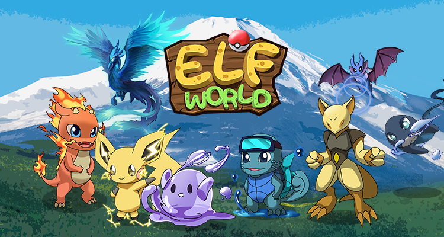

# Welcome to Elfworld!

Elfworld là một thể loại GameFi với nhân vật chính được gọi là Elfs. Được truyền cảm hứng từ các nhân vật hư cấu trong các bộ phim, hoạt hình và trò chơi quen thuộc gắn với tuổi thơ của nhiều thế hệ. Tại đây, chúng tôi dựng lên một vũ trụ bao la ngập tràn những sinh vật đáng mến này.

Elfs là các **nhân vật NFT** được **tạo ra dựa trên chuẩn ERC-721**, có thể giao dịch trên Marketplace của game. Cho phép người chơi sử dụng Cầu Elf để thu phục Elf, đồng thời thông qua các chiến lược về huấn luyện, chiến đấu,… để có thể **nhận được $ELFT.** Ngoài ra còn có nhiều tính năng game thú vị sẽ được phát triển và sớm ra mắt.

Game được xây dựng và vận hành trên nền tảng BSC (Binance Smart Chain) để đảm bảo **phí giao dịch thấp**. Nền tảng tương thích với MetaMask và các loại ví Web3 khác, hỗ trợ giao dịch và thanh toán phí gas. Ví MetaMask có thể được cài đặt trên trang tiện ích mở rộng của trình duyệt, hoặc ở dạng ứng dụng trên thiết bị di động.
