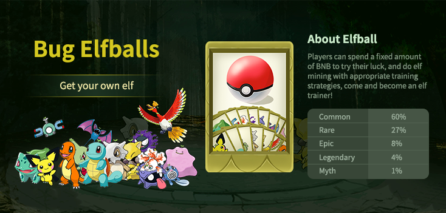
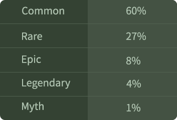

# Elfball

Elfball is a collection of elf game items, and the process has random properties. Depending on the nature of the game, you will get elf with different rarity levels.

#### the Creation elfball

There are 8,000 Creation pokeballs, 4,000 of which cost 0.2 BNB each, and up to 10 per purchase. The remaining 4,000 were purchased using ELFT. There are the following rare elves distribution in Creation elfball:

The rarity level is legend &gt; Myth &gt; Epic &gt; Rare &gt; Normal.

