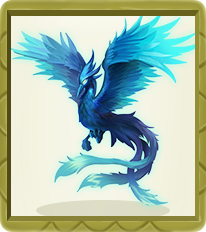
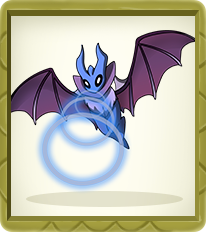
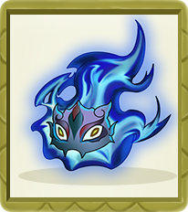
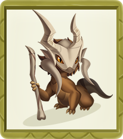

# NFT Characters

Players can randomly obtain elf by purchasing the Elfball. Currently there are a total of 12 Creation Elves, covering 12 Egg Groups. Future updates with the game will breed new varieties of elf.

### Ho-Oh 

It has a mythical power to resurrect the dead. It was the only known elf to learn Sacred Fire, its former signature move. It is said that when it flies its huge wings create bright, colorful rainbows. The rare few who bear witness to it is promised eternal happiness.



| Type      | Value                   |
| --------- | ----------------------- |
| Type      | Fire                    |
| Rarity    | UR                      |
| Height    | 3.8m                    |
| Weight    | 199.0kg                 |
| Evolution | Ho-Oh→ Ho-oh-X→ Ho-oh-Y |



| Type                      | Value |
| ------------------------- | ----- |
| AKT (Attack Power)        | 21737 |
|  HP (Hit Points)          | 15140 |
| POT (Potential)           | 80    |
| STA (Stamina)             | 1514  |
| _+sta_                    | 30.3  |
| STR (Strength)            | 1478  |
| _+str_                    | 36.5  |
| AGI (Agility)             | 2536  |
| _+agi_                    | 44.6  |
| INT (Intelligence)        | 2690  |
| _+int_                    | 36.5  |
| DAM (Damage)              | 5400  |
| ADF (Magic Defense)       | 2690  |
| ARM (Armor)               | 1477  |
| CRE (Critical Resistance) | 739   |
| CRI (Critical)            | 1268  |
| EVA (Evasion)             | 1080  |
| HIT                       | 757   |
| SPE (Speed)               | 2536  |



| Type      | Value             |
| --------- | ----------------- |
| Egg Group | Alpha             |
| Gender    | Male : Female=1:1 |



| Name           | Description                                                                                                           |
| -------------- | --------------------------------------------------------------------------------------------------------------------- |
| Sacred Fire    | Inflicts 100% fire-type damage to 2 targets with less HP, and has a chance to burn the target for 2 rounds            |
| Sacred Fire•I  | Inflicts 100% fire-type damage to 2 targets with less HP, and has has greater chance to burn the targets for 2 rounds |
| Sacred Fire•II | Inflicts 100% fire-type damage to 2 targets with less HP, and will surely burn the targets for 2 rounds               |
| Sky Attack     | Inflicts 100% fire-type damage to all enemies, and has a chance to reduce the rage of all targets by 25               |
| Sky Attack•Ⅰ   | Inflicts 125% fire-type damage to all enemies , and has greater chance to reduce rage of all targets by 25            |
| Sky Attack•Ⅱ   | Inflicts 160% fire-type damage to all enemies , and will surely reduce rage of all targets by 25                      |



### Magnemite 

The electromagnetic waves released by the components on the left and right shield the gravity, thus floating in the air. The parts on the left and right are powerful magnets. It can emit strong magnetic force enough to attract iron within a radius of 100 meters.



| Type      | Value                          |
| --------- | ------------------------------ |
| Type      | Electric                       |
| Rarity    | GR                             |
| Height    | 0.3m                           |
| Weight    | 6.0kg                          |
| Evolution | Magnemite→ Magneton→ Magnezone |



| Type                      | Value |
| ------------------------- | ----- |
| AKT (Attack Power)        | 8087  |
| HP (Hit Points )          | 8100  |
| POT (Potential)           | 32    |
| STA (Stamina)             | 810   |
| _+sta_                    | 16.5  |
| STR (Strength)            | 1013  |
| _+str_                    | 20.7  |
| AGI (Agility)             | 810   |
| _+agi_                    | 16.5  |
| INT (Intelligence)        | 405   |
| _+int_                    | 8     |
| DAM (Damage)              | 2026  |
| ADF (Magic Defense)       | 405   |
| ARM (Armor)               | 1013  |
| CRE (Critical Resistance) | 507   |
| CRI (Critical)            | 405   |
| EVA (Evasion)             | 162   |
| HIT                       | 405   |
| SPE (Speed)               | 810   |



| Type      | Value               |
| --------- | ------------------- |
| Egg Group | Mineral             |
| Gender    | Male : Female = 1:1 |



| Name            | Description                                                                                                                                     |
| --------------- | ----------------------------------------------------------------------------------------------------------------------------------------------- |
| Thunder Shock   | Inflicts 120% electric-type damage to a single enemy in the rear row                                                                            |
| Thunder Shock•Ⅰ | Inflicts 150% electric-type damage to a single enemy in the rear row                                                                            |
| Thunder Shock•Ⅱ | Inflicts 200% electric-type damage to a single enemy in the rear row                                                                            |
| Magnet Rise     | Inflicts 90% electric-type damage to the enemy's rear row , and has a chance to reduce the target's attack power and armor by 15% for 2 rounds  |
| Magnet Rise•Ⅰ   | Inflicts 110% electric-type damage to the enemy's rear row , and has a chance to reduce the target's attack power and armor by 20% for 2 rounds |
| Magnet Rise•Ⅱ   | Inflicts 130% electric-type damage to the enemy's rear row , and will surely reduce the target's attack power and armor by 25% for 2 rounds     |



### Pichu 

It is usually found in groups and often touch tails with other Pichu as a show of courage, creating a shower of sparks that can make them cry. It is inept at storing electricity and may discharge if amused, startled, or subjected to shock. However, it cannot discharge without being shocked itself. Charging up is more easily done on days of dryness or with thunderclouds. The crackling of static electricity generated by Pichu is audible. It can zap an adult human but will surprise itself if it does.



| Type      | Value                  |
| --------- | ---------------------- |
| Type      | Electric               |
| Rarity    | GR                     |
| Height    | 0.3m                   |
| Weight    | 2.0kg                  |
| Evolution | Pichu→ Pikachu→ Raichu |



| Type                      | Value |
| ------------------------- | ----- |
| AKT (Attack Power)        | 8176  |
| HP (Hit Points)           | 6330  |
| POT (Potential)           | 32    |
| STA (Stamina)             | 633   |
| _+sta_                    | 12.1  |
| STR (Strength)            | 1056  |
| _+str_                    | 20.3  |
| AGI (Agility)             | 887   |
| _+agi_                    | 17.1  |
| INT (Intelligence)        | 464   |
| _+int_                    | 8.9   |
| DAM (Damage)              | 2112  |
| ADF (Magic Defense)       | 464   |
| ARM (Armor)               | 1056  |
| CRE (Critical Resistance) | 528   |
| CRI (Critical)            | 444   |
| EVA (Evasion)             | 186   |
| HIT                       | 317   |
| SPE (Speed)               | 887   |



| Type      | Value               |
| --------- | ------------------- |
| Egg Group | Fairy/Field         |
| Gender    | Male : Female = 1:1 |



| Name            | Description                                                                                                                                                                  |
| --------------- | ---------------------------------------------------------------------------------------------------------------------------------------------------------------------------- |
| Thunder Shock   | Move to the front of the enemy target and release lightning, causing the enemy front row to take 180% electric-type damage and reduce the target's armor by 10% for 2 rounds |
| Thunder Shock•Ⅰ | Move to the front of the enemy target and release lightning, causing the enemy front row to take 210% electric-type damage and reduce the target's armor by 20% for 2 rounds |
| Thunder Shock•Ⅱ | Move to the front of the enemy target and release lightning, causing the enemy front row to take 240% electric-type damage and reduce the target's armor by 40% for 2 rounds |
| Thunderbolt     | Releases a lightning beam, causing 250% electric-type damage to a single enemy target , with a high probability to stun the target for 1 turn                                |
| Thunderbolt•Ⅰ   | Releases a lightning beam, causing 300% electric-type damage to a single enemy target , with a high probability to stun the target for 2 rounds                              |
| Thunderbolt•Ⅱ   | Releases a lightning beam, causing 350% electric-type damage to a single enemy target , with will surely stun the target for 2 turns                                         |



### Zubat 

It started activities after the sun went down. Because its skin is so thin that it burns as long as it is exposed to the sun, it sleeps in the dark during the day. When the weather gets cold, they will huddle together to keep warm.



| Type      | Value                 |
| --------- | --------------------- |
| Type      | Grass                 |
| Rarity    | SSR                   |
| Height    | 0.8m                  |
| Weight    | 7.5kg                 |
| Evolution | Zubat→ Golbat→ Crobat |



| Type                      | Value |
| ------------------------- | ----- |
| AKT (Attack Power)        | 3894  |
| HP (Hit Points)           | 3400  |
| POT (Potential)           | 16    |
| STA (Stamina)             | 340   |
| _+sta_                    | 7.8   |
| STR (Strength)            | 512   |
| +_str_                    | 10    |
| AGI (Agility)             | 325   |
| _+agi_                    | 6.2   |
| INT (Intelligence)        | 263   |
| _+int_                    | 5     |
| DAM (Damage)              | 1024  |
| ADF (Magic Defense)       | 263   |
| ARM (Armor)               | 512   |
| CRE (Critical Resistance) | 256   |
| CRI (Critical)            | 163   |
| EVA (Evasion)             | 105   |
| HIT                       | 170   |
| SPE (Speed)               | 325   |



| Type      | Value               |
| --------- | ------------------- |
| Egg Group | Flying              |
| Gender    | Male : Female = 1:1 |



| Name         | Description                                                                                                               |
| ------------ | ------------------------------------------------------------------------------------------------------------------------- |
| Leech Life   | Inflicts 65% grass-type damage to all enemies in the front row                                                            |
| Leech Life•Ⅰ | Inflicts 80% grass-type damage to all enemies in the front row                                                            |
| Leech Life•Ⅱ | Inflicts 100% grass-type damage to all enemies in the front row                                                           |
| Supersonic   | Inflicts 100% grass-type damage to all enemies in the front row, and has a chance to reduce the target's rage by 50       |
| Supersonic•Ⅰ | Inflicts 120% grass-type damage to all enemies in the front row, and has greater chance to reduce the target's rage by 50 |
| Supersonic•Ⅱ | Inflicts 160% grass-type damage to all enemies in the front row, and will surely reduce the target's rage by 50           |



### Charmander 

The flame on its tail can express its emotions. When it is happy, the flame will flicker. If it is provoked, the flame will burn violently. When he was born, there was a fire burning on his tail. When the fire on the tail goes out, its life is over.



| Type      | Value                             |
| --------- | --------------------------------- |
| Type      | Fire                              |
| Rarity    | SSR                               |
| Height    | 0.6m                              |
| Weight    | 8.5kg                             |
| Evolution | Charmander→ Charmeleon→ Charizard |



| Type                      | Value |
| ------------------------- | ----- |
| AKT (Attack Power)        | 3764  |
| HP (Hit Points)           | 3450  |
| POT (Potential)           | 16    |
| STA (Stamina)             | 345   |
| _+sta_                    | 7     |
| STR (Strength)            | 225   |
| _+str_                    | 4.4   |
| AGI (Agility)             | 420   |
| _+agi_                    | 8.5   |
| INT (Intelligence)        | 450   |
| _+int_                    | 9.3   |
| DAM (Damage)              | 900   |
| ADF (Magic Defense)       | 450   |
| ARM (Armor)               | 225   |
| CRE (Critical Resistance) | 113   |
| CRI (Critical)            | 210   |
| EVA (Evasion)             | 180   |
| HIT                       | 173   |
| SPE (Speed)               | 420   |



| Type      | Value             |
| --------- | ----------------- |
| Egg Group | Dragon/Monster    |
| Gender    | Male : Female=1:1 |



| Name        | Description                                                                                                                                                        |
| ----------- | ------------------------------------------------------------------------------------------------------------------------------------------------------------------ |
| Ember       | Spit out a fireball, dealing 120% fire-type damage to a single enemy target in the front row                                                                       |
| Ember•Ⅰ     | Spit out a fireball, dealing 150% fire-type damage to a single enemy target in the front row                                                                       |
| Ember•Ⅱ     | Spit out a fireball, dealing 200% fire-type damage to a single enemy target in the front row                                                                       |
| Jet Flame   | The jet pierces through the flame, causing 160% fire-type damage to the enemy's vertical target , and has a chance to cause burning damage, lasting 3 rounds       |
| Jet Flame•Ⅰ | The jet pierces through the flame, causing 200% fire-type damage to the enemy's vertical target , and has greater chance to cause burning damage, lasting 3 rounds |
| Jet Flame•Ⅱ | The jet pierces through the flame, causing 280% fire-type damage to the enemy's vertical target , and will surely cause burning damage, lasting 3 rounds           |



### Bulbasaur 

Its most notable feature is the bulbous seed behind it. There is a symbiotic relationship between the seed and the frog. Since its birth, the seed and the body have grown together.



| Type      | Value                        |
| --------- | ---------------------------- |
| Type      | Grass                        |
| Rarity    | SSR                          |
| Height    | 0.7m                         |
| Weight    | 6.9kg                        |
| Evolution | Bulbasaur→ Ivysaur→ Venusaur |



| Type                      | Value |
| ------------------------- | ----- |
| AKT (Attack Power)        | 3823  |
| HP (Hit Points)           | 3000  |
| POT (Potential)           | 16    |
| STA (Stamina)             | 300   |
| _+sta_                    | 6.1   |
| STR (Strength)            | 195   |
| +_str_                    | 4     |
| AGI (Agility)             | 465   |
| _+agi_                    | 9.4   |
| INT (Intelligence)        | 480   |
| _+int_                    | 9.7   |
| DAM (Damage)              | 960   |
| ADF (Magic Defense)       | 480   |
| ARM (Armor)               | 195   |
| CRE (Critical Resistance) | 98    |
| CRI (Critical)            | 233   |
| EVA (Evasion)             | 192   |
| HIT                       | 150   |
| SPE (Speed)               | 465   |



| Type      | Value             |
| --------- | ----------------- |
| Egg Group | Grass/Monster     |
| Gender    | Male : Female=1:1 |



| Name         | Description                                                                                                                   |
| ------------ | ----------------------------------------------------------------------------------------------------------------------------- |
| Vine Whip    | Summons a Vine Whip, inflicts 120% grass-type damage to a single enemy target in the rear row                                 |
| Vine Whip•Ⅰ  | Summons a Vine Whip, inflicts 150% grass-type damage to a single enemy target in the rear row                                 |
| Vine Whip•Ⅱ  | Summons a Vine Whip, inflicts 180% grass-type damage to a single enemy target in the rear row                                 |
| Razor Leaf   | Move to the middle of the enemy lineup, summon the swirling leaves, inflicts 120% grass-type damage to 4 random enemy targets |
| Razor Leaf•Ⅰ | Move to the middle of the enemy lineup, summon swirling leaves, inflicts 150% grass-type damage to 5 random enemy targets     |
| Razor Leaf•Ⅱ | Move to the middle of the enemy lineup and summon swirling leaves, inflicts 180% grass-type damage to all enemy targets       |



### Gastly 

It can make an Indian elephant fall in two seconds by enclosing it with poisonous gas. In some occasional situations, it will gain the ability to speak like a human and be able to transform its own form. It can communicate with telepathy, create phantoms, transform into a girl or an old woman, and communicate with the soul of the dead.



| Type      | Value                   |
| --------- | ----------------------- |
| Type      | Ghost                   |
| Rarity    | SSR                     |
| Height    | 1.3m                    |
| Weight    | 0.1kg                   |
| Evolution | Gastly→ Haunter→ Gengar |



| Type                      | Value |
| ------------------------- | ----- |
| AKT (Attack Power)        | 3869  |
| HP (Hit Points)           | 3200  |
| POT (Potential)           | 16    |
| STA (Stamina)             | 320   |
| _+sta_                    | 7.3   |
| STR (Strength)            | 520   |
| +_str_                    | 10.6  |
| AGI (Agility)             | 300   |
| _+agi_                    | 6.3   |
| INT (Intelligence)        | 280   |
| _+int_                    | 25    |
| DAM (Damage)              | 1040  |
| ADF (Magic Defense)       | 280   |
| ARM (Armor)               | 520   |
| CRE (Critical Resistance) | 260   |
| CRI (Critical)            | 150   |
| EVA (Evasion)             | 112   |
| HIT                       | 160   |
| SPE (Speed)               | 300   |



| Type      | Value             |
| --------- | ----------------- |
| Egg Group | Amorphous         |
| Gender    | Male : Female=1:1 |



| Name           | Description                                                                   |
| -------------- | ----------------------------------------------------------------------------- |
| Shadow Ball    | Inflicts 90% ghost-type damage to the enemy front row single                  |
| Shadow Ball•Ⅰ  | Inflicts 110% ghost-type damage to the enemy front row single                 |
| Shadow Ball•Ⅱ  | Inflicts 150% ghost-type damage to the enemy front row single                 |
| Shadow Punch   | Inflicts 180% ghost-type damage to the enemy elf with the lowest health       |
| Shadow Punch•Ⅰ | Inflicts 220% ghost-type damage to the enemy elf with the lowest health       |
| Shadow Punch•Ⅱ | Inflicts 260% ghost-type damage to the two enemy elves with the lowest health |



### Cubone 

It has been wearing the skull of his deceased mother, so it is not clear what his true appearance is. The skull worn in sadness and loneliness will swing and make a short-term sad sound. It is said that it is related to the bag dragon, and it is suspected to be the baby of the bag dragon.



| Type      | Value                      |
| --------- | -------------------------- |
| Type      | Water                      |
| Rarity    | SR                         |
| Height    | 0.4m                       |
| Weight    | 6.5g                       |
| Evolution | Cubone→ Marowak→ Marowak-X |



| Type                      | Value |
| ------------------------- | ----- |
| AKT (Attack Power)        | 819   |
| HP (Hit Points)           | 830   |
| POT (Potential)           | 7     |
| STA (Stamina)             | 83    |
| _+sta_                    | 3.5   |
| STR (Strength)            | 70    |
| _+str_                    | 2.4   |
| AGI (Agility)             | 78    |
| _+agi_                    | 2.9   |
| INT (Intelligence)        | 90    |
| _+int_                    | 4     |
| DAM (Damage)              | 180   |
| ADF (Magic Defense)       | 90    |
| ARM (Armor)               | 70    |
| CRE (Critical Resistance) | 35    |
| CRI (Critical)            | 39    |
| EVA (Evasion)             | 36    |
| HIT                       | 42    |
| SPE (Speed)               | 78    |



| Type      | Value             |
| --------- | ----------------- |
| Egg Group | Monster           |
| Gender    | Male : Female=1:1 |



| Name          | Description                                            |
| ------------- | ------------------------------------------------------ |
| Flame Wheel   | Inflicts 105% fire-type damage to the enemy's rear row |
| Flame Wheel•Ⅰ | Inflicts 145% fire-type damage to the enemy's rear row |
| Flame Wheel•Ⅱ | Inflicts 195% fire-type damage to the enemy's rear row |
| Flame Burst   | Inflicts 100% fire-type damage to all enemies          |
| Flame Burst•Ⅰ | Inflicts 120% fire-type damage to all enemies          |
| Flame Burst•Ⅱ | Inflicts 150% fire-type damage to all enemies          |



### Abra 

It can sense danger through a telepathic radar. When it does, it teleports to a safe location. However, it sometimes becomes panicked if it wakes in an unknown location. By hypnotizing itself, it is able to teleport itself even while sleeping. It can use other extrasensory abilities while sleeping as well and can even teleport into the treetops to pick and eat berries. The deeper sleeps, the farther it teleports. Due to the strain of its telepathic powers, however, it sleeps 18 hours each day. If it fails to rest long enough, it will become unable to use its powers. The contents in it's dream can affect its powers.



| Type      | Value                   |
| --------- | ----------------------- |
| Type      | Psychic                 |
| Rarity    | SR                      |
| Height    | 0.9m                    |
| Weight    | 19.5kg                  |
| Evolution | Abra→ Kadabra→ Alakazam |



| Type                      | Value |
| ------------------------- | ----- |
| AKT (Attack Power)        | 823   |
| HP (Hit Points)           | 730   |
| POT (Potential)           | 7     |
| STA (Stamina)             | 73    |
| _+sta_                    | 3.5   |
| STR (Strength)            | 91    |
| +_str_                    | 3.8   |
| AGI (Agility)             | 87    |
| _+agi_                    | 2.9   |
| INT (Intelligence)        | 69    |
| _+int_                    | 2.6   |
| DAM (Damage)              | 182   |
| ADF (Magic Defense)       | 69    |
| ARM (Armor)               | 91    |
| CRE (Critical Resistance) | 46    |
| CRI (Critical)            | 44    |
| EVA (Evasion)             | 28    |
| HIT                       | 37    |
| SPE (Speed)               | 87    |



| Type      | Value             |
| --------- | ----------------- |
| Egg Group | Human-Like        |
| Gender    | Male : Female=1:1 |



### Piplup 

It has a strong sense of self-pride. Because of its pride, it has a hard time accepting food from humans and bonding with its caretakers. It will even puff out its chest after it falls down, which it often does due to its poor walking abilities. However, it is a skilled swimmer that can dive for over ten minutes in order to hunt. It has also been shown to fly short distances.



| Type      | Value                      |
| --------- | -------------------------- |
| Type      | Water                      |
| Rarity    | R                          |
| Height    | 0.4m                       |
| Weight    | 5.2kg                      |
| Evolution | Piplup→ Prinplup→ Empoleon |



| Type                      | Value |
| ------------------------- | ----- |
| AKT (Attack Power)        | 513   |
| HP (Hit Points)           | 560   |
| POT (Potential)           | 4     |
| STA (Stamina)             | 56    |
| _+sta_                    | 2.3   |
| STR (Strength)            | 42    |
| +_str_                    | 1.4   |
| AGI (Agility)             | 44    |
| _+agi_                    | 1.5   |
| INT (Intelligence)        | 58    |
| _+int_                    | 2.4   |
| DAM (Damage)              | 116   |
| ADF (Magic Defense)       | 58    |
| ARM (Armor)               | 42    |
| CRE (Critical Resistance) | 21    |
| CRI (Critical)            | 22    |
| EVA (Evasion)             | 23    |
| HIT                       | 28    |
| SPE (Speed)               | 44    |



| Type      | Value             |
| --------- | ----------------- |
| Egg Group | Wate/Field        |
| Gender    | Male : Female=1:1 |



### Poliwag 

It has a long, thin tail surrounded by a light-blue, semitransparent fin. Its tail makes it a powerful swimmer. It loves to waddle on land despite the dangers. However, it will quickly return back into the water should it see danger. It cannot walk on land well unless trained everyday.



| Type      | Value                         |
| --------- | ----------------------------- |
| Type      | Water                         |
| Rarity    | N                             |
| Height    | 0.6m                          |
| Weight    | 12.4kg                        |
| Evolution | Poliwag→ Poliwhirl→ Poliwrath |



| Type                      | Value |
| ------------------------- | ----- |
| AKT (Attack Power)        | 210   |
| HP (Hit Points)           | 220   |
| POT (Potential)           | 2     |
| STA (Stamina)             | 22    |
| _+sta_                    | 1.5   |
| STR (Strength)            | 15    |
| +_str_                    | 1.2   |
| AGI (Agility)             | 18    |
| _+agi_                    | 1.3   |
| INT (Intelligence)        | 25    |
| _+int_                    | 1.6   |
| DAM (Damage)              | 50    |
| ADF (Magic Defense)       | 25    |
| ARM (Armor)               | 15    |
| CRE (Critical Resistance) | 8     |
| CRI (Critical)            | 9     |
| EVA (Evasion)             | 10    |
| HIT                       | 11    |
| SPE (Speed)               | 18    |



| Type      | Value             |
| --------- | ----------------- |
| Egg Group | Water             |
| Gender    | Male : Female=1:1 |



### Caterpie 

As it grow and develop over time, it will shed its skin many times before finally cocooning itself in thick silk. It has a voracious appetite, which drives it to eat a hundred leaves a day. It will even eat leaves bigger than itself. Its favorite food is the Vermilion flower. It lives in temperate forests and jungles.



| Type      | Value                         |
| --------- | ----------------------------- |
| Type      | Grass                         |
| Rarity    | N                             |
| Height    | 0.3m                          |
| Weight    | 2.9kg                         |
| Evolution | Caterpie→ Metapod→ Butterfree |



| Type                      | Value |
| ------------------------- | ----- |
| AKT (Attack Power)        | 210   |
| HP (Hit Points)           | 220   |
| POT (Potential)           | 2     |
| STA (Stamina)             | 22    |
| _+sta_                    | 1.5   |
| STR (Strength)            | 15    |
| +_str_                    | 1.2   |
| AGI (Agility)             | 18    |
| _+agi_                    | 1.3   |
| INT (Intelligence)        | 25    |
| _+int_                    | 1.6   |
| DAM (Damage)              | 50    |
| ADF (Magic Defense)       | 25    |
| ARM (Armor)               | 15    |
| CRE (Critical Resistance) | 8     |
| CRI (Critical)            | 9     |
| EVA (Evasion)             | 10    |
| HIT                       | 11    |
| SPE (Speed)               | 18    |



| Type      | Value             |
| --------- | ----------------- |
| Egg Group | Bug               |
| Gender    | Male : Female=1:1 |



### &#x20;
