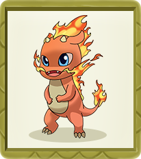
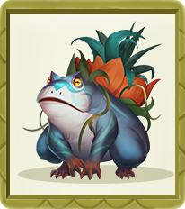
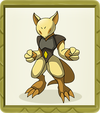
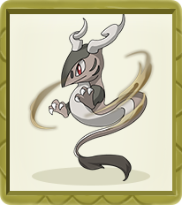
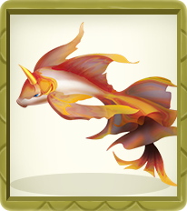

# NFT Characters

Players can purchase fairy balls to randomly acquire elves. There are currently 15 types of Genesis elves, covering 15 egg groups. New types of elf will be created in the future as the game is updated.

### Ho-Oh 

It has a mythical power to resurrect the dead. It was the only known Pokémon to learn Sacred Fire, its former signature move. It is said that when it flies its huge wings create bright, colorful rainbows. The rare few who bear witness to it is promised eternal happiness.



| Type      | Value                      |
| --------- | -------------------------- |
| Type      | Fire                       |
| Rarity    | UR                         |
| Height    | 3.8m                       |
| Weight    | 199.0kg                    |
| Evolution | Ho-Oh → Ho-oh-X → Ho-oh--X |



| Type                      | Value |
| ------------------------- | ----- |
| Attack Power (AKT)        | 22226 |
| Hit Points (HP)           | 15141 |
| POT (Potential)           | 80    |
| STA (Stamina)             | 1371  |
| _+STA_                    | 121   |
| STR (Strength)            | 1338  |
| +_STR_                    | 146   |
| AGI (Agility)             | 2537  |
| _+AGI_                    | 178.6 |
| INT (Intelligence)        | 2433  |
| _+INT_                    | 146   |
| DAM (Damage)              | 5372  |
| ADF (Magic Defense)       | 2686  |
| ARM (Armor)               | 1477  |
| CRE (Critical Resistance) | 739   |
| CRI (Critical)            | 1402  |
| EVA (Evasion)             | 1075  |
| HIT                       | 757   |
| SPE (Speed)               | 2801  |



| Type      | Value             |
| --------- | ----------------- |
| Egg Group | Alpha             |
| Gender    | Male : Female=1:1 |



### Magnemite 

The electromagnetic waves released by the components on the left and right shield the gravity, thus floating in the air. The parts on the left and right are powerful magnets. It can emit strong magnetic force enough to attract iron within a radius of 100 meters.



| Type      | Value                            |
| --------- | -------------------------------- |
| Type      | Electric                         |
| Rarity    | GR                               |
| Height    | 0.3m                             |
| Weight    | 6.0kg                            |
| Evolution | Magnemite → Magneton → Magnezone |



| Type                      | Value |
| ------------------------- | ----- |
| Attack Power (AKT)        |       |
| Hit Points (HP)           |       |
| POT (Potential)           |       |
| STA (Stamina)             |       |
| _+STA_                    |       |
| STR (Strength)            |       |
| +_STR_                    |       |
| AGI (Agility)             |       |
| _+AGI_                    |       |
| INT (Intelligence)        |       |
| _+INT_                    |       |
| DAM (Damage)              |       |
| ADF (Magic Defense)       |       |
| ARM (Armor)               |       |
| CRE (Critical Resistance) |       |
| CRI (Critical)            |       |
| EVA (Evasion)             |       |
| HIT                       |       |
| SPE (Speed)               |       |



| Type      | Value             |
| --------- | ----------------- |
| Egg Group | Mineral           |
| Gender    | Male : Female=1:1 |



### Pichu 

It is usually found in groups and often touch tails with other Pichu as a show of courage, creating a shower of sparks that can make them cry. It is inept at storing electricity and may discharge if amused, startled, or subjected to shock. However, it cannot discharge without being shocked itself. Charging up is more easily done on days of dryness or with thunderclouds. The crackling of static electricity generated by Pichu is audible. It can zap an adult human but will surprise itself if it does.



| Type      | Value                |
| --------- | -------------------- |
| Type      | Electric             |
| Rarity    | Rare                 |
| Height    | 0.3m                 |
| Weight    | 2.0kg                |
| Evolution | Pichu→Pikachu→Raichu |



| Type            | value |
| --------------- | ----- |
| HP              | 20    |
| Attach          | 40    |
| Defense         | 15    |
| Special Attack  | 35    |
| Special Defense | 35    |
| Speed           | 60    |



| Type      | value             |
| --------- | ----------------- |
| Egg Group | Field/Fairy       |
| Gender    | Male : Female=1:1 |





| Type      | Value                            |
| --------- | -------------------------------- |
| Type      | Electric                         |
| Rarity    | GR                               |
| Height    | 0.3m                             |
| Weight    | 6.0kg                            |
| Evolution | Magnemite → Magneton → Magnezone |



| Type                      | Value |
| ------------------------- | ----- |
| Attack Power (AKT)        |       |
| Hit Points (HP)           |       |
| POT (Potential)           |       |
| STA (Stamina)             |       |
| _+STA_                    |       |
| STR (Strength)            |       |
| +_STR_                    |       |
| AGI (Agility)             |       |
| _+AGI_                    |       |
| INT (Intelligence)        |       |
| _+INT_                    |       |
| DAM (Damage)              |       |
| ADF (Magic Defense)       |       |
| ARM (Armor)               |       |
| CRE (Critical Resistance) |       |
| CRI (Critical)            |       |
| EVA (Evasion)             |       |
| HIT                       |       |
| SPE (Speed)               |       |



| Type      | Value             |
| --------- | ----------------- |
| Egg Group | Mineral           |
| Gender    | Male : Female=1:1 |



1

### Zubat 

It started activities after the sun went down. Because its skin is so thin that it burns as long as it is exposed to the sun, it sleeps in the dark during the day. When the weather gets cold, they will huddle together to keep warm.



| Type      | Value               |
| --------- | ------------------- |
| Type      | Poison/Flying       |
| Rarity    | N                   |
| Height    | 0.8m                |
| Weight    | 7.5kg               |
| Evolution | Zubat→Golbat→Crobat |



| Type            | value |
| --------------- | ----- |
| HP              | 40    |
| Attach          | 45    |
| Defense         | 35    |
| Special Attack  | 30    |
| Special Defense | 40    |
| Speed           | 55    |



| Type      | value             |
| --------- | ----------------- |
| Egg Group | Flying            |
| Gender    | Male : Female=1:1 |





| Type      | Value                            |
| --------- | -------------------------------- |
| Type      | Electric                         |
| Rarity    | GR                               |
| Height    | 0.3m                             |
| Weight    | 6.0kg                            |
| Evolution | Magnemite → Magneton → Magnezone |



| Type                      | Value |
| ------------------------- | ----- |
| Attack Power (AKT)        |       |
| Hit Points (HP)           |       |
| POT (Potential)           |       |
| STA (Stamina)             |       |
| _+STA_                    |       |
| STR (Strength)            |       |
| +_STR_                    |       |
| AGI (Agility)             |       |
| _+AGI_                    |       |
| INT (Intelligence)        |       |
| _+INT_                    |       |
| DAM (Damage)              |       |
| ADF (Magic Defense)       |       |
| ARM (Armor)               |       |
| CRE (Critical Resistance) |       |
| CRI (Critical)            |       |
| EVA (Evasion)             |       |
| HIT                       |       |
| SPE (Speed)               |       |



| Type      | Value             |
| --------- | ----------------- |
| Egg Group | Mineral           |
| Gender    | Male : Female=1:1 |



1

### Charmander 

The flame on its tail can express its emotions. When it is happy, the flame will flicker. If it is provoked, the flame will burn violently. When he was born, there was a fire burning on his tail. When the fire on the tail goes out, its life is over.



| Type      | Value                           |
| --------- | ------------------------------- |
| Type      | Fire                            |
| Rarity    | R                               |
| Height    | 0.6m                            |
| Weight    | 8.5kg                           |
| Evolution | Charmander→Charmeleon→Charizard |



| Type            | value |
| --------------- | ----- |
| HP              | 39    |
| Attach          | 52    |
| Defense         | 43    |
| Special Attack  | 60    |
| Special Defense | 50    |
| Speed           | 65    |



| Type      | value             |
| --------- | ----------------- |
| Egg Group | Monster/Dragon    |
| Gender    | Male : Female=1:1 |





| Type      | Value                            |
| --------- | -------------------------------- |
| Type      | Electric                         |
| Rarity    | GR                               |
| Height    | 0.3m                             |
| Weight    | 6.0kg                            |
| Evolution | Magnemite → Magneton → Magnezone |



| Type                      | Value |
| ------------------------- | ----- |
| Attack Power (AKT)        |       |
| Hit Points (HP)           |       |
| POT (Potential)           |       |
| STA (Stamina)             |       |
| _+STA_                    |       |
| STR (Strength)            |       |
| +_STR_                    |       |
| AGI (Agility)             |       |
| _+AGI_                    |       |
| INT (Intelligence)        |       |
| _+INT_                    |       |
| DAM (Damage)              |       |
| ADF (Magic Defense)       |       |
| ARM (Armor)               |       |
| CRE (Critical Resistance) |       |
| CRI (Critical)            |       |
| EVA (Evasion)             |       |
| HIT                       |       |
| SPE (Speed)               |       |



| Type      | Value             |
| --------- | ----------------- |
| Egg Group | Mineral           |
| Gender    | Male : Female=1:1 |



1

### Bulbasaur 

Its most notable feature is the bulbous seed behind it. There is a symbiotic relationship between the seed and the frog. Since its birth, the seed and the body have grown together.



| Type      | Value                      |
| --------- | -------------------------- |
| Type      | Grass/Poison               |
| Rarity    | R                          |
| Height    | 0.7m                       |
| Weight    | 6.9kg                      |
| Evolution | Bulbasaur→Ivysaur→Venusaur |



| Type            | value |
| --------------- | ----- |
| HP              | 45    |
| Attach          | 49    |
| Defense         | 49    |
| Special Attack  | 65    |
| Special Defense | 65    |
| Speed           | 45    |



| Type      | value             |
| --------- | ----------------- |
| Egg Group | Monster/Grass     |
| Gender    | Male : Female=1:1 |





| Type      | Value                            |
| --------- | -------------------------------- |
| Type      | Electric                         |
| Rarity    | GR                               |
| Height    | 0.3m                             |
| Weight    | 6.0kg                            |
| Evolution | Magnemite → Magneton → Magnezone |



| Type                      | Value |
| ------------------------- | ----- |
| Attack Power (AKT)        |       |
| Hit Points (HP)           |       |
| POT (Potential)           |       |
| STA (Stamina)             |       |
| _+STA_                    |       |
| STR (Strength)            |       |
| +_STR_                    |       |
| AGI (Agility)             |       |
| _+AGI_                    |       |
| INT (Intelligence)        |       |
| _+INT_                    |       |
| DAM (Damage)              |       |
| ADF (Magic Defense)       |       |
| ARM (Armor)               |       |
| CRE (Critical Resistance) |       |
| CRI (Critical)            |       |
| EVA (Evasion)             |       |
| HIT                       |       |
| SPE (Speed)               |       |



| Type      | Value             |
| --------- | ----------------- |
| Egg Group | Mineral           |
| Gender    | Male : Female=1:1 |



1

### Gastly 

It can make an Indian elephant fall in two seconds by enclosing it with poisonous gas. In some occasional situations, it will gain the ability to speak like a human and be able to transform its own form. It can communicate with telepathy, create phantoms, transform into a girl or an old woman, and communicate with the soul of the dead.



| Type      | Value                 |
| --------- | --------------------- |
| Type      | Ghost/Poison          |
| Rarity    | SR                    |
| Height    | 1.3m                  |
| Weight    | 0.1kg                 |
| Evolution | Gastly→Haunter→Gengar |



| Type            | value |
| --------------- | ----- |
| HP              | 30    |
| Attach          | 35    |
| Defense         | 30    |
| Special Attack  | 100   |
| Special Defense | 35    |
| Speed           | 80    |



| Type      | value             |
| --------- | ----------------- |
| Egg Group | Amorphous         |
| Gender    | Male : Female=1:1 |





| Type      | Value                            |
| --------- | -------------------------------- |
| Type      | Electric                         |
| Rarity    | GR                               |
| Height    | 0.3m                             |
| Weight    | 6.0kg                            |
| Evolution | Magnemite → Magneton → Magnezone |



| Type                      | Value |
| ------------------------- | ----- |
| Attack Power (AKT)        |       |
| Hit Points (HP)           |       |
| POT (Potential)           |       |
| STA (Stamina)             |       |
| _+STA_                    |       |
| STR (Strength)            |       |
| +_STR_                    |       |
| AGI (Agility)             |       |
| _+AGI_                    |       |
| INT (Intelligence)        |       |
| _+INT_                    |       |
| DAM (Damage)              |       |
| ADF (Magic Defense)       |       |
| ARM (Armor)               |       |
| CRE (Critical Resistance) |       |
| CRI (Critical)            |       |
| EVA (Evasion)             |       |
| HIT                       |       |
| SPE (Speed)               |       |



| Type      | Value             |
| --------- | ----------------- |
| Egg Group | Mineral           |
| Gender    | Male : Female=1:1 |



### Cubone 

It has been wearing the skull of his deceased mother, so it is not clear what his true appearance is. The skull worn in sadness and loneliness will swing and make a short-term sad sound. It is said that it is related to the bag dragon, and it is suspected to be the baby of the bag dragon.



| Type      | Value          |
| --------- | -------------- |
| Type      | Ground         |
| Rarity    | SR             |
| Height    | 0.4m           |
| Weight    | 6.5kg          |
| Evolution | Cubone→Marowak |



| Type            | value |
| --------------- | ----- |
| HP              | 50    |
| Attach          | 50    |
| Defense         | 95    |
| Special Attack  | 40    |
| Special Defense | 50    |
| Speed           | 35    |



| Type      | value             |
| --------- | ----------------- |
| Egg Group | Monster           |
| Gender    | Male : Female=1:1 |





| Type      | Value                            |
| --------- | -------------------------------- |
| Type      | Electric                         |
| Rarity    | GR                               |
| Height    | 0.3m                             |
| Weight    | 6.0kg                            |
| Evolution | Magnemite → Magneton → Magnezone |



| Type                      | Value |
| ------------------------- | ----- |
| Attack Power (AKT)        |       |
| Hit Points (HP)           |       |
| POT (Potential)           |       |
| STA (Stamina)             |       |
| _+STA_                    |       |
| STR (Strength)            |       |
| +_STR_                    |       |
| AGI (Agility)             |       |
| _+AGI_                    |       |
| INT (Intelligence)        |       |
| _+INT_                    |       |
| DAM (Damage)              |       |
| ADF (Magic Defense)       |       |
| ARM (Armor)               |       |
| CRE (Critical Resistance) |       |
| CRI (Critical)            |       |
| EVA (Evasion)             |       |
| HIT                       |       |
| SPE (Speed)               |       |



| Type      | Value             |
| --------- | ----------------- |
| Egg Group | Mineral           |
| Gender    | Male : Female=1:1 |



1

### Abra 

It can sense danger through a telepathic radar. When it does, it teleports to a safe location. However, it sometimes becomes panicked if it wakes in an unknown location. By hypnotizing itself, it is able to teleport itself even while sleeping. It can use other extrasensory abilities while sleeping as well and can even teleport into the treetops to pick and eat berries. The deeper sleeps, the farther it teleports. Due to the strain of its telepathic powers, however, it sleeps 18 hours each day. If it fails to rest long enough, it will become unable to use its powers. The contents in it's dream can affect its powers.



| Type      | Value                 |
| --------- | --------------------- |
| Type      | Psychic               |
| Rarity    | SSR                   |
| Height    | 0.9m                  |
| Weight    | 19.5kg                |
| Evolution | Abra→Kadabra→Alakazam |



| Type            | value |
| --------------- | ----- |
| HP              | 25    |
| Attach          | 20    |
| Defense         | 15    |
| Special Attack  | 105   |
| Special Defense | 55    |
| Speed           | 90    |



| Type      | value             |
| --------- | ----------------- |
| Egg Group | Human-Like        |
| Gender    | Male : Female=1:1 |





| Type      | Value                            |
| --------- | -------------------------------- |
| Type      | Electric                         |
| Rarity    | GR                               |
| Height    | 0.3m                             |
| Weight    | 6.0kg                            |
| Evolution | Magnemite → Magneton → Magnezone |



| Type                      | Value |
| ------------------------- | ----- |
| Attack Power (AKT)        |       |
| Hit Points (HP)           |       |
| POT (Potential)           |       |
| STA (Stamina)             |       |
| _+STA_                    |       |
| STR (Strength)            |       |
| +_STR_                    |       |
| AGI (Agility)             |       |
| _+AGI_                    |       |
| INT (Intelligence)        |       |
| _+INT_                    |       |
| DAM (Damage)              |       |
| ADF (Magic Defense)       |       |
| ARM (Armor)               |       |
| CRE (Critical Resistance) |       |
| CRI (Critical)            |       |
| EVA (Evasion)             |       |
| HIT                       |       |
| SPE (Speed)               |       |



| Type      | Value             |
| --------- | ----------------- |
| Egg Group | Mineral           |
| Gender    | Male : Female=1:1 |



1

### Piplup 

It is an adept hunter that tears at its prey with its scythes. Thanks to its green coloration, it can camouflage itself well in the grasslands and forests where it lives. Humans rarely encounter wild it in these areas, however. Said to be like a ninja, It can move so quickly that it cannot be followed, increasing the effectiveness of its scythes. It maintains the sharpness of its blades through battle as well as by cutting through hard objects, such as trees; it can cut down a massive tree with just a single slice. The anime has shown that wild It form swarms with a single leader chosen through combat. When a challenger successfully defeats a current leader and replaced it, the defeated leader is exiled from the swarm. It has also been shown that It becomes aggressive when faced with the color red.



| Type      | Value                        |
| --------- | ---------------------------- |
| Type      | Water                        |
| Rarity    | GR                           |
| Height    | 0.4m                         |
| Weight    | 5.2kg                        |
| Evolution | Piplup → Prinplup → Empoleon |



| Type                      | Value |
| ------------------------- | ----- |
| AKT(Attack Power )        |       |
| Hit Points (HP)           |       |
| POT (Potential)           |       |
| STA (Stamina)             |       |
| _+STA_                    |       |
| STR (Strength)            |       |
| +_STR_                    |       |
| AGI (Agility)             |       |
| _+AGI_                    |       |
| INT (Intelligence)        |       |
| _+INT_                    |       |
| DAM (Damage)              |       |
| ADF (Magic Defense)       |       |
| ARM (Armor)               |       |
| CRE (Critical Resistance) |       |
| CRI (Critical)            |       |
| EVA (Evasion)             |       |
| HIT                       |       |
| SPE (Speed)               |       |



| Type      | Value             |
| --------- | ----------------- |
| Egg Group | Water             |
| Gender    | Male : Female=1:1 |



### Poliwag 

It has a long, thin tail surrounded by a light-blue, semitransparent fin. Its tail makes it a powerful swimmer. It loves to waddle on land despite the dangers. However, it will quickly return back into the water should it see danger. It cannot walk on land well unless trained everyday.



| Type      | Value                       |
| --------- | --------------------------- |
| Type      | Water                       |
| Rarity    | N                           |
| Height    | 0.6m                        |
| Weight    | 12.4kg                      |
| Evolution | Poliwag→Poliwhirl→Poliwrath |



| Type            | value |
| --------------- | ----- |
| HP              | 40    |
| Attach          | 50    |
| Defense         | 40    |
| Special Attack  | 40    |
| Special Defense | 40    |
| Speed           | 90    |



| Type      | value             |
| --------- | ----------------- |
| Egg Group | Water 1           |
| Gender    | Male : Female=1:1 |





| Type      | Value                         |
| --------- | ----------------------------- |
| Type      | Water                         |
| Rarity    | N                             |
| Height    | 0.6m                          |
| Weight    | 12.4kg                        |
| Evolution | Poliwag→ Poliwhirl→ Poliwrath |



| Type                      | Value |
| ------------------------- | ----- |
|  AKT(Attack Power)        |       |
| Hit Points (HP)           |       |
| POT (Potential)           |       |
| STA (Stamina)             |       |
| _+STA_                    |       |
| STR (Strength)            |       |
| +_STR_                    |       |
| AGI (Agility)             |       |
| _+AGI_                    |       |
| INT (Intelligence)        |       |
| _+INT_                    |       |
| DAM (Damage)              |       |
| ADF (Magic Defense)       |       |
| ARM (Armor)               |       |
| CRE (Critical Resistance) |       |
| CRI (Critical)            |       |
| EVA (Evasion)             |       |
| HIT                       |       |
| SPE (Speed)               |       |



| Type      | Value             |
| --------- | ----------------- |
| Egg Group | Mineral           |
| Gender    | Male : Female=1:1 |



### Caterpie 

As it grow and develop over time, it will shed its skin many times before finally cocooning itself in thick silk. It has a voracious appetite, which drives it to eat a hundred leaves a day. It will even eat leaves bigger than itself. According to Pokémon Adventures, its favorite food is the Vermilion flower. It lives in temperate forests and jungles.



| Type      | Value                         |
| --------- | ----------------------------- |
| Type      | Electric                      |
| Rarity    | N                             |
| Height    | 0.3m                          |
| Weight    | 2.9kg                         |
| Evolution | Caterpie→ Metapod→ Butterfree |



| Type                      | Value |
| ------------------------- | ----- |
| AKT( Attack Power)        |       |
|  HP(Hit Points)           |       |
| POT (Potential)           |       |
| STA (Stamina)             |       |
| _+STA_                    |       |
| STR (Strength)            |       |
| +_STR_                    |       |
| AGI (Agility)             |       |
| _+AGI_                    |       |
| INT (Intelligence)        |       |
| _+INT_                    |       |
| DAM (Damage)              |       |
| ADF (Magic Defense)       |       |
| ARM (Armor)               |       |
| CRE (Critical Resistance) |       |
| CRI (Critical)            |       |
| EVA (Evasion)             |       |
| HIT                       |       |
| SPE (Speed)               |       |



| Type      | Value             |
| --------- | ----------------- |
| Egg Group | Bug               |
| Gender    | Male : Female=1:1 |



### &#x20;

