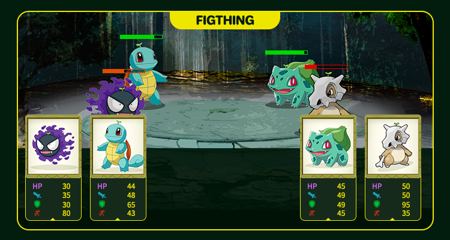

# Duel Field (Trailer)

The duel field is where the elf compete. The battle system is based on the skill attributes of the elf to determine the winner and loser. The winner will be rewarded. We believe this is a key direction for the future development of the game.

In a battle, the elves of both sides will use moves to reduce the HP of the other elves, and the elves of the other side will use defensive moves to resist attacks and reduce their HP. Until the HP of one elf drops to 0, the other elf wins.

#### More gameplay

Elf will continue to introduce new and different aspects of gameplay, coming soon...
