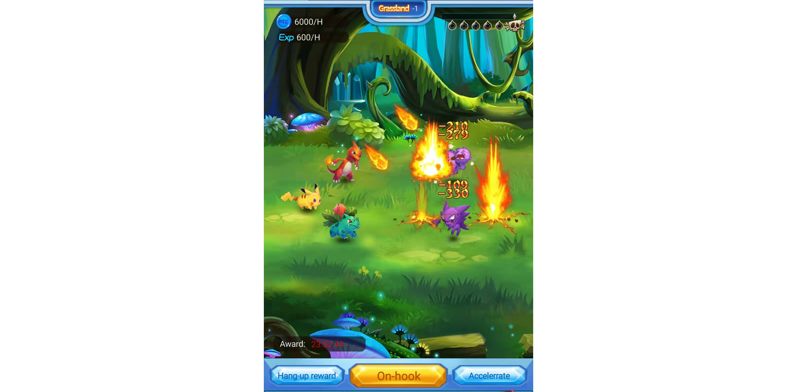

# Challenge BOSS

Players advance through the levels by challenging BOSS, uninterrupted online and offline hang-ups, and quickly increase the rate of gaining EXP and WEG per hour.

#### Online Hang-up

The position where the player hangs up is the level currently being challenged

There is a fixed point in the battle scene to refresh the monsters, and the refreshed monsters appear according to the time cycle

1-3 monsters per refresh

The next level can only be entered after the challenge level is won, and the levels need to be challenged in sequence

Every time you complete 3 normal levels, you need to challenge 1 elite level

No challenge scrolls are required to challenge normal levels, no matter whether you succeed or not, and will not consume free challenges

Ordinary levels can be challenged all the time, there is no limit to the number of times

After completing the challenge of the elite level, you can sweep the level in the elite dungeon

If you fail to challenge a level or an elite level and return to the current level, you can continue to challenge

#### Offline Hang-up

After going online, the rewards will be calculated and distributed to the players according to the offline time of the players.

Displays the interval between players offline and online, in seconds

There is no reward for being offline for less than 5 minutes

The EXP that all elves in the current battle can get in the hang-up

Up to 6 elves in battle
