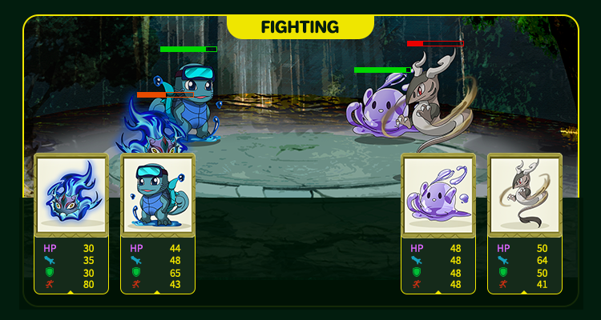

# Duel Field (Trailer)

The duel field is where the elf compete. The battle system is based on the skill attributes of the elf to determine the winner and loser. The winner will be rewarded. We believe this is a key direction for the future development of the game.

The dueling field is divided into two parts: PVE and PVP. Equipment and props, and the improvement of the level can bring higher benefits to PVE and PVP battles.

#### More gameplay

Elf will continue to introduce new and different aspects of gameplay, coming soon...
