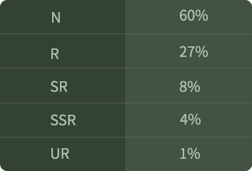

# Quả Cầu Elf

Quả cầu Elf là vật phẩm để thu thập Elf, quá trình thu thập sẽ có tỉ lệ ngẫu nhiên. Người chơi sẽ có cơ hội nhận được các Elfs ở độ hiếm khác nhau.

#### **Quả Cầu Elf**

Quả cầu Genesis Elf

Trong game có tổng cộng 9,000 quả Genesis Elf, trong đó có 8,000 quả trong các đợt bán Box. Trong đó 4,000 quả với giá 0.2 BNB, 4000 quả còn lại mua bằng ELFT. Mỗi địa chỉ nhiều nhất mua được 10 cái. Còn lại 1,000 quả Genesis Elf có thể nhận được từ tính năng thám hiểm trong game sau này.

Quả cầu Elf Thường

Quả cầu Elf Thường được tạo ra từ việc cho Elf nhân giống. Elf nở ra từ Quả Cầu Elf Thường và Quả Cầu Genesis Elf.

Xác suất xuất hiện theo độ hiếm của quả cầu Elf:

**Cấp độ hiếm sẽ là:** UR >GR> SSR > SR > R > N .

| Độ hiếm | Tỷ lệ               |
| ------- | ------------------- |
| N       | Normal              |
| R       | Rare                |
| SR      | Super Rare          |
| SSR     | Superior Super Rare |
| GR      | Gold Rare           |
| UR      | Ultra Rare          |

Có 2 giới tính của Elfs với tỉ lệ xuất hiện bằng nhau.
